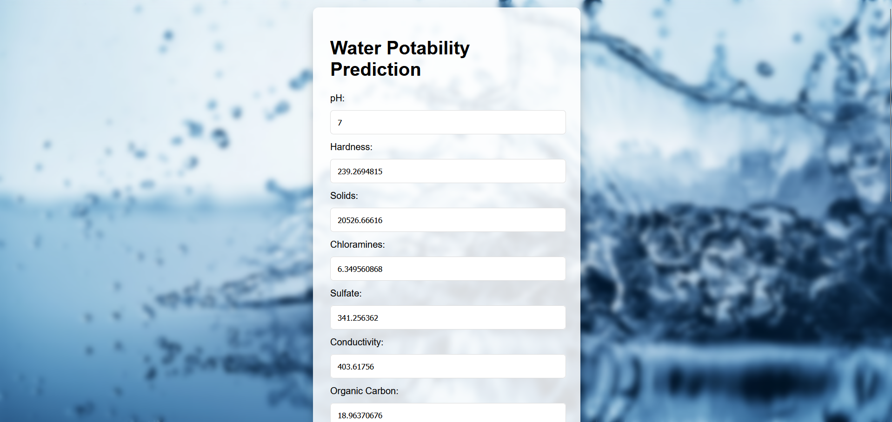
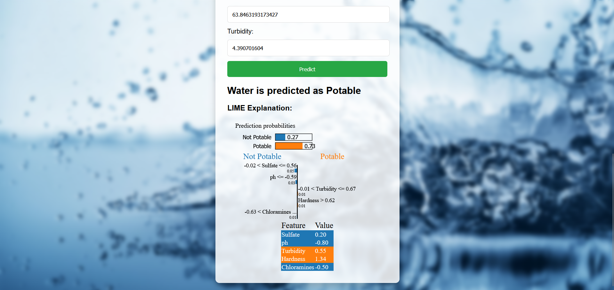

# Water Potability Prediction
 
This project predicts whether water is potable (safe to drink) using machine learning models. The deployed web application allows users to input water quality parameters and obtain a prediction of potability, along with LIME explanations for model interpretability.

## Features
- Pre-trained machine learning models: Random Forest, XGBoost, AdaBoost, SVM, KNN, and CNN.
- Web app using Flask for easy prediction.
- LIME model explanations for interpretability.

## Setup & Installation

1. Clone the repository:
    ```bash
    git clone https://github.com/45beepy/Water-Potability-Prediction.git
    cd Water-Potability-Prediction
    ```

2. Install dependencies:
    ```bash
    pip install -r requirements.txt
    ```

## Running the Application

1. Start the Flask server:
    ```bash
    python app.py
    ```

2. Open a browser and go to `http://localhost:5000`.

## Model Training
Pre-trained models are included in `.pkl` files. If you want to retrain the models, use the `model_training.py` script. The pre-trained models include:

- `best_model.pkl` - The final selected model
- `best_random_forest_model.pkl` - The tuned Random Forest model
- Other models saved for performance comparison.

## Files and Directory Structure

- **app.py**: The Flask web application.
- **model_training.py**: Script for training models.
- **best_model.pkl**: The best-performing pre-trained model.
- **requirements.txt**: Dependencies for running the project.
- **templates/index.html**: The front-end HTML file.

## Acknowledgments
Thanks to the contributors and open-source libraries that made this project possible.

## Results


---
